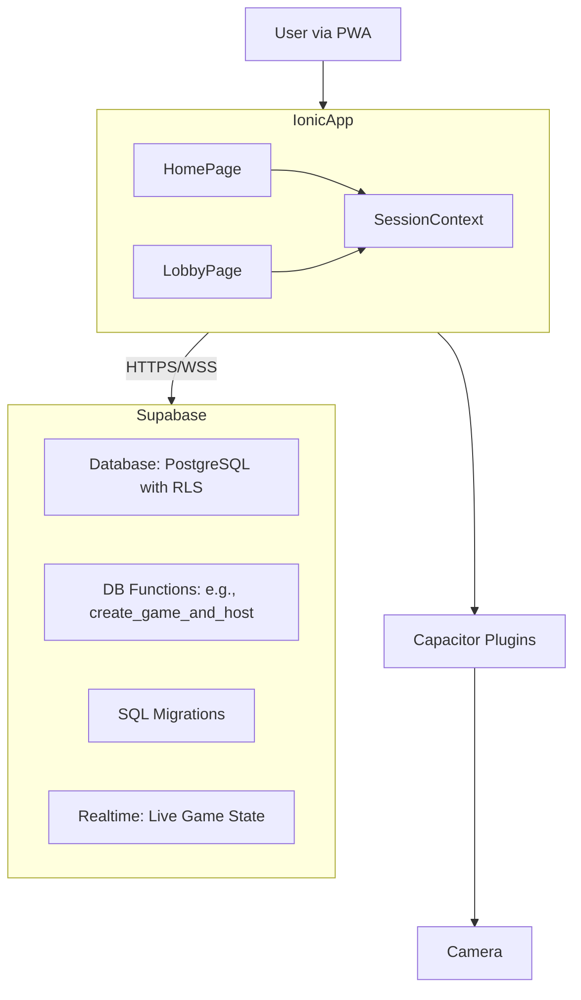

# System Patterns: The Chicken Chase

## 1. Overall Architecture
A Progressive Web App (PWA) built with Ionic React for the frontend, connected to a Supabase backend. The architecture is designed for a frictionless, "no signup" user experience, using a modern React Context for session management.

## 2. Key Design Patterns
*   **Model-View-Controller (MVC)-like Structure:**
    *   **Model:** Supabase Database, enriched with transactional SQL functions (`create_game_and_host`) and versioned via Migrations.
    *   **View:** Ionic React components, now decomposed into "smart" pages (like `LobbyPage`) and "dumb" presentational components (`TeamSelectionView`).
    *   **Controller:** React Hooks and component logic.
*   **Component-Based UI:** Enhanced by refactoring large pages into smaller, focused components.
*   **State Management:**
    *   **Local State:** `useState` for component-specific state.
    *   **Session State:** **`SessionContext`**, a React Context that holds `playerId`, `gameId`, and `nickname`. This is the single source of truth for the session, replacing `localStorage`.
    *   **Shared/Global State:** A combination of React Context and custom hooks.
*   **Real-time Subscriptions:** Supabase Realtime remains the backbone of the app for live data.
*   **Transactional Database Functions:** For complex, atomic operations (like creating a game AND its host player), we use plpgsql functions in Supabase, ensuring data integrity.
*   **Database Migrations:** All schema changes are now managed through version-controlled SQL migration files in `supabase/migrations`.

## 3. Data Flow Examples

### a. Player Joins a Game (SessionContext Flow)
1.  User opens PWA, lands on `HomePage`.
2.  **To Create:** User clicks "Create Game".
    a.  The PWA calls the `create_game_and_host` function in Supabase.
    b.  The function creates the game, the host player, links them, and returns a JSON object with `{ game_id, player_id, join_code }`.
    c.  The `HomePage` uses the `setSession` function from `useSession()` to populate the `SessionContext`.
    d.  The PWA navigates to `LobbyPage`.
3.  **To Join:** User clicks "Join Game", navigates to `JoinGamePage` and enters a `join_code` and `nickname`.
    a.  The PWA finds the `game_id` and creates a new player in the `players` table.
    b.  On success, it uses `setSession` to populate the `SessionContext`.
    c.  The PWA navigates to `LobbyPage`.
4.  **Reconnection:** In `LobbyPage`, a `useEffect` checks if the `session` from the context is valid for the current `gameId`. If not, it redirects to `HomePage`. This makes the session ephemeral and tied to the browser tab's state.

### b. Hunter Submits a Challenge (Photo Proof Flow)
1.  Hunter is in `PlayerPage`, viewing live challenges from the `usePlayerGameData` hook.
2.  Hunter clicks a photo challenge, opening the `CameraModal` (via Capacitor Camera).
3.  Hunter takes a photo.
4.  The `handlePhotoProofSubmit` function is called:
    a.  The photo is uploaded to Supabase Storage in a path like `challenge-submissions/{game_id}/{team_id}/{challenge_id}.jpg`.
    b.  After upload, a new row is inserted into the `challenge_submissions` table with the `team_id`, `challenge_id`, and the public `photo_url`. The status is set to `pending`.
5.  This new row in `challenge_submissions` will eventually be displayed in the Host/Chicken's validation UI (powered by another real-time subscription).

## 4. Critical Implementation Paths
*   **Session Context Integrity:** The `SessionContext` is the new heart of the user experience. All components requiring session data must use the `useSession()` hook.
*   **Component Decomposition:** The refactoring of `LobbyPage` into smaller components (`TeamSelectionView`, `WaitingRoomView`) is a core pattern to be applied to other complex pages like `PlayerPage`.
*   **Database Migrations:** All future database changes **must** be done via new, timestamped migration files to ensure a reproducible environment.

## 5. Styling and UI Consistency
*   **Ionic Theming:** Utilize Ionic CSS variables for base theme and dark mode.
*   **Component Library:** Rely on Ionic components for core UI elements.
*   **Ionic CSS Utilities:** Prefer Ionic's built-in utility classes (`ion-padding`, `ion-text-center`, etc.) for consistent styling, as per `cursor_rules`.
*   **Goal:** A consistent and recognizable look and feel, prioritizing ease of use, especially in low-light/social environments. 